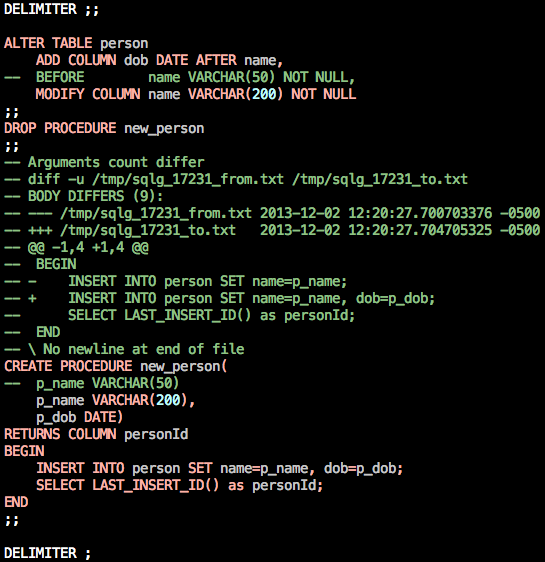

[](https://travis-ci.org/OnlineBuddies/Modyllic)

Modyllic is an SQL parser and set of schema management tools, written in PHP
5.2, and useful for anyone working with SQL.

Modyllic is at its core, a tool for managing schema changes across branches.
Because it allows you to store your schema as DDL, it means that merges
between branches are easily handled using standard tools.  In addition to
analysis (dump and diff) tools, it also provides migration tools (migrate,
apply).  It also provides tools for making working with stored procedures in
PHP much easier-- it comes with a tool for generating a PHP wrapper for
calling your stored procedures that include type checking and fully inflated
return values, eg, you can return a table and get an array containing all of
the rows without a separate fetch step.

Three primary use cases are:

* Detecting and examining differences between databases.

* Replacing conventional linear up/down scripts with more flexible
  change management.

* Providing a consistant, safe and transparent access to stored routines.

Modyllic operates on "schemas", which can represent database, table, and
column definitions, routines, events, triggers, as well as data.  They are
stored in files as the SQL statements that would normally be used to create
the tables.  Schemas can be specified on the command line as:

* A DSN that connects to a live database
* A filename
* A directory
* A comma-separated list of more than one of the above (in which case
  all sources will be combined)

The flexibility of combining multiple sources makes it easy to deal
separately with the status quo schema vs. just the changes you intend
to make.

DSNs should include username and password if needed.  For convenience,
you can use ":" instead of ";" since shells often barf on ";" unless
you are careful with your quoting.  So, you could write either of the
following:

    mysql:host=database-server.example.org;dbname=MyDB;username=bobby;password=someThingClever
    mysql:host=database-server.example.org:dbname=MyDB:username=bobby:password=someThingClever

Available tools:

*All tools accept --help for usage information.*

### `modyllic migrate -f DSN -t SCHEMA`

Make the live database at DSN look like the one described by SCHEMA.  You
could think of it as running `modyllic diff -d MySQL DSN SCHEMA` and
applying the diff to the live database.

### `modyllic diff SCHEMA1 SCHEMA2`
Produce the ALTER statements etc. that would make SCHEMA1 look like SCHEMA2. 
This is smarter than running "diff" on two SQL dumps, because it actually
parses SQL, ignores some things that should be ignored, and is sensitive to
the semantic context.  This essentially shows you what "migrate" would do
given the same arguments.

````sql
DELIMITER ;;

ALTER TABLE person
    ADD COLUMN dob DATE AFTER name,
--  BEFORE        name VARCHAR(50) NOT NULL,
    MODIFY COLUMN name VARCHAR(200) NOT NULL
;;
DROP PROCEDURE new_person
;;
-- Arguments count differ
-- diff -u /tmp/sqlg_14782_from.txt /tmp/sqlg_14782_to.txt
-- BODY DIFFERS (9):
-- --- /tmp/sqlg_14782_from.txt 2013-12-02 10:35:06.549095299 -0500
-- +++ /tmp/sqlg_14782_to.txt   2013-12-02 10:35:06.549095299 -0500
-- @@ -1,4 +1,4 @@
--  BEGIN
-- -    INSERT INTO person SET name=p_name;
-- +    INSERT INTO person SET name=p_name, dob=p_dob;
--      SELECT LAST_INSERT_ID() as personId;
--  END
-- \ No newline at end of file
CREATE PROCEDURE new_person(
    p_name VARCHAR(200),
    p_dob DATE)
RETURNS COLUMN personId
BEGIN
    INSERT INTO person SET name=p_name, dob=p_dob;
    SELECT LAST_INSERT_ID() as personId;
END
;;

DELIMITER ;
````

### `modyllic drop SCHEMA`

Produces the `DROP`, `DELETE`, etc. commands to delete SCHEMA (but doesn't
actually modify anything).  It's the equivalent of `modyllic diff SCHEMA
/dev/null`.

````sql
DELIMITER ;;

DROP PROCEDURE new_person
;;
DROP TABLE person
;;

DELIMITER ;
````

*And again with the MySQL output dialect:*

````sql
SET @OLD_FOREIGN_KEY_CHECKS=@@FOREIGN_KEY_CHECKS, FOREIGN_KEY_CHECKS=0;
SET NAMES 'utf8';
DELIMITER ;;

DROP PROCEDURE IF EXISTS new_person
;;
DROP TABLE IF EXISTS MODYLLIC
;;
DROP TABLE IF EXISTS person
;;

DELIMITER ;
SET FOREIGN_KEY_CHECKS=@OLD_FOREIGN_KEY_CHECKS;
````

### `modyllic dump SCHEMA`
Produces the CREATE, INSERT, etc. commands to create SCHEMA from scratch. 
This is Modyllic's replacement for `mysqldump
-d` which gives you the output choice of several SQL dialects from the
very concise to its own metadata-rich format.  You could also think of
it as the equivalent of `modyllic diff /dev/null SCHEMA`.

````sql
DELIMITER ;;

CREATE TABLE person (
    personId SERIAL PRIMARY KEY,
    name VARCHAR(50) NOT NULL
) ENGINE=InnoDB
;;
CREATE PROCEDURE new_person(
    p_name VARCHAR(200))
RETURNS COLUMN personId
BEGIN
    INSERT INTO person SET name=p_name;
    SELECT LAST_INSERT_ID() as personId;
END
;;

DELIMITER ;
````

*And again with the MySQL output dialect:*

````sql
SET @OLD_FOREIGN_KEY_CHECKS=@@FOREIGN_KEY_CHECKS, FOREIGN_KEY_CHECKS=0;
SET NAMES 'utf8';
DELIMITER ;;

CREATE TABLE person (
    personId BIGINT UNSIGNED NOT NULL auto_increment PRIMARY KEY,
    name VARCHAR(50) NOT NULL
) ENGINE=InnoDB
;;
-- This is used to store metadata used by the schema management tool
CREATE TABLE MODYLLIC (
    kind CHAR(9) NOT NULL,
    which CHAR(90) NOT NULL,
    value VARCHAR(20000) NOT NULL,
    PRIMARY KEY (kind,which)
) ENGINE=InnoDB
;;
TRUNCATE TABLE MODYLLIC
;;
INSERT INTO MODYLLIC SET kind='COLUMN', which='person.personId', value='{"type":"SERIAL","unique":true}'
;;
INSERT INTO MODYLLIC SET kind='INDEX', which='person.!PRIMARY KEY', value='{"column_defined":true}'
;;
INSERT INTO MODYLLIC SET kind='TABLE', which='MODYLLIC', value='{"static":true}'
;;
INSERT INTO MODYLLIC SET kind='ROUTINE', which='new_person', value='{"returns":{"type":"COLUMN","column":"personId"}}'
;;
CREATE PROCEDURE new_person(
    p_name VARCHAR(200))
BEGIN
    INSERT INTO person SET name=p_name;
    SELECT LAST_INSERT_ID() as personId;
END
;;

DELIMITER ;
SET FOREIGN_KEY_CHECKS=@OLD_FOREIGN_KEY_CHECKS;
````

### `modyllic procstophp SCHEMA`

Generate a PHP helper class for the stored procs in the schema.

````php
<?php
class Database {
    /**
     * @param $dbh
     * @param VARCHAR(200) $p_name
     * @returns personId
     */
    public static function new_person($dbh, $p_name) {
        assert('is_null($p_name) or is_scalar($p_name)');
        assert('is_null($p_name) or mb_strlen($p_name) <= 200');
        $sth = $dbh->prepare('CALL new_person(:p_name)');
        $sth->bindValue(':p_name', isset($p_name)? (string)$p_name: null, PDO::PARAM_STR);
        $sth->execute();
        try {
            $row = $sth->fetch(PDO::FETCH_ASSOC);
            $sth->closeCursor();
            if ( $row === false ) {
                return ;
            }
            assert('isset($row[\'personId\'])');
            return $row['personId'];
        }
        catch (PDOException $e) {
            if (strpos($e->getMessage(), 'SQLSTATE[HY000]: General error') !== false) {
                throw new PDOException('General error while fetching return value of new_person; this usually means that you declared this routine as having a return value but it does not actually select any data before completing.');
            }
            else {
                throw $e;
            }
        }
    }
}
````

### `cat FILENAME.sql | modyllic colorize`

Useful for debugging, just pipe some SQL to it on STDIN and it will put a
colorized, syntax-highlighted version on STDOUT.



`modyllic preparse FILENAME.sql > FILENAME.sqlc` - Can be used to optimize the
performance of other tools by "pre-compiling" their input.  The other tools
will load a `.sqlc` file in preference to a `.sql` if it is newer.
